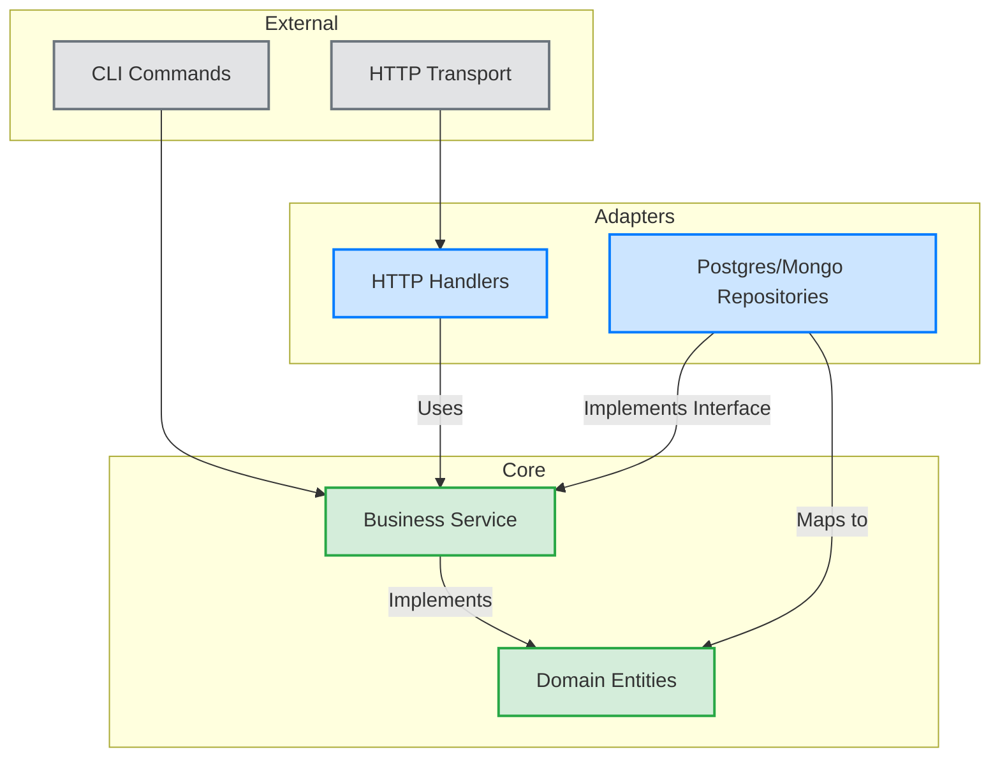
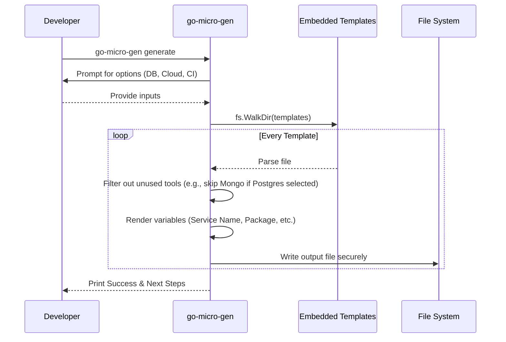

<div align="center">

```
             _   _   __  __  ____    ____   _____  _   _ 
   ____ ___ | | | | |  \/  |/ ___|  / ___| | ____|| \ | |
  / __// _ \| |_| | | |\/| |\___ \ | |  _  |  _|  |  \| |
 | (_ | (_) |  _  | | |  | | ___) || |_| | | |___ | |\  |
  \__\ \___/|_| |_| |_|  |_||____/  \____| |_____||_| \_|
```

# go-micro-gen — The Ultimate Microservice Scaffolder

**One command to scaffold a production-ready Go microservice.**


</div>

---

## What is go-micro-gen?

`go-micro-gen` is a CLI tool that scaffolds a complete, production-ready Go microservice **in seconds**. 

Unlike a simple "Hello World" generator, `go-micro-gen` sets up an **entire ecosystem** ensuring you follow industry best practices right from the start.

### ✨ Key Features
- ✅ **Multi-Architecture** layouts: Clean, Hexagonal, Domain-Driven Design (DDD), Vertical Slice, and Standard
- ✅ **OpenTelemetry** (traces + metrics) pre-configured
- ✅ **Cleanenv** configuration manager
- ✅ **PostgreSQL or MongoDB** implementations with the Repository Pattern
- ✅ **Message Broker** support (Kafka, RabbitMQ, NATS)
- ✅ **Cloud Provider Support** boilerplate (AWS & GCP)
- ✅ **Database Migrations** out of the box (with `golang-migrate`)
- ✅ **Docker & Docker-Compose** (App + DB + Redis + Prometheus + Grafana)
- ✅ **GitHub Actions / GitLab CI Pipeline** configurations
- ✅ **Standard Makefile** tools and `.golangci.yml` linter setup
- ✅ **Graceful shutdown**, unit tests, and health/readiness endpoints

---

## Architecture Overview

`go-micro-gen` enforces a Clean Architecture approach where dependencies flow inward towards the `Domain` layer. The service layer is completely agnostic to external databases and transports.



---

## Installation

### Method 1: Download Pre-Compiled Binaries (Recommended for Windows & macOS)
You don't need Go installed! Just go to the [Releases page](https://github.com/Aro-M/go-micro-gen/releases) and download the `.exe` (Windows) or binary (macOS / Linux) specifically for your system. We automatically compile and publish AMD64 and ARM64 (Apple Silicon) versions on every release.

### Method 1: `go install` (Easiest)

If you have Go installed, you can simply download and install the latest version globally:

```bash
go install github.com/Aro-M/go-micro-gen@latest
```
*(Note: If Go caches an older version, you can force a fresh download using `GOPROXY=direct go install github.com/Aro-M/go-micro-gen@latest`).*

**✅ Troubleshooting `command not found`:**
If your terminal says `go-micro-gen: command not found` after a successful installation, your Go bin directory is not in your `$PATH`. 
Fix it by running the following commands:
```bash
echo 'export PATH=$PATH:$(go env GOPATH)/bin' >> ~/.bashrc
source ~/.bashrc
```

### Method 2: Build from source

```bash
git clone https://github.com/Aro-M/go-micro-gen
cd go-micro-gen
go build -o go-micro-gen .
sudo mv go-micro-gen /usr/local/bin/
```

### Verify Installation

```bash
go-micro-gen --version
go-micro-gen --help
```

### Uninstalling

If you ever wish to remove the tool:

```bash
go-micro-gen uninstall
```

---

## Quick Start

### Interactive Mode

Simply run the `generate` command and answer the prompts:

```bash
go-micro-gen generate
```

You'll see an interactive interface like this:

```text
? Service name:          order-service
? Go module path:        github.com/acme/order-service
? Architecture pattern:  [clean / hexagonal / ddd / vertical / standard]
? Database:              [postgres / mongo / none]
? Message Broker:        [kafka / rabbitmq / nats / none]
? Transport Protocol:    [http / grpc / both]
? Include Redis?         (y/N)
? Include Docker & Docker Compose setup? (Y/n)
? Include Kubernetes manifests (Deployment, Service, etc.)? (y/N)
? Include Helm charts?   (y/N)
? Cloud provider:        [aws / gcp / none]
? CI/CD provider:        [github / gitlab / none]
? Output directory:      ./order-service

  Service:  order-service
  Module:   github.com/acme/order-service
  Arch:     clean
  DB:       postgres
  Broker:   kafka
  Transp:   both
  Redis:    false
  Docker:   true
  K8s:      false
  Helm:     false
  Cloud:    aws
  CI:       github
  Output:   ./order-service

? Generate service with these settings? Yes

🚀 Generating order-service ...
```

### Scripted / Non-Interactive Mode

You can supply arguments via flags for CI pipelines or scripts:

```bash
go-micro-gen generate \
  --name payment-service \
  --module github.com/acme/payment-service \
  --db postgres \
  --broker kafka \
  --transport grpc \
  --arch ddd \
  --cloud aws \
  --ci github \
  --redis=false \
  --docker=false \
  --k8s=false \
  --helm=false \
  --output ./payment-service \
  --yes
```

### Init Mode

If you already have an existing project (with a `go.mod`), you can inject the microservice structure directly into the current directory in various architectural options:

```bash
go-micro-gen init \
  --arch vertical \
  --db mongo \
  --broker rabbitmq \
  --transport both \
  --yes
```
This infers the module path and service name automatically and scaffolds the files within `.`.

---

## What Happens Under the Hood?

`go-micro-gen` embeds a complete set of `.tmpl` files and stitches together a service based on your selections. 



---

## Structure of the Generated Service

A generated service (`order-service`) typically looks like this:

```
order-service/
│
├── cmd/
│   └── main.go                    # Entrypoint — DI & App wiring happens here
│
├── internal/                      # Internal packages
│   ├── config/                    # cleanenv mapped configs 
│   ├── domain/                    # Business objects (Entities)
│   ├── repository/                # DB interfaces & implementations
│   ├── service/                   # Pure business logic layer
│   └── transport/                 # HTTP routers and handlers using chi
│
├── pkg/                           # Public utilities
│   ├── health/                    # Liveness/Readiness probes
│   ├── logger/                    # Structured logging (log/slog)
│   └── telemetry/                 # OpenTelemetry traces & metrics
│
├── db/migrations/                 # Database schema migrations (.sql)
├── docker/                        # Docker & Docker Compose setup
├── .github/                       # CI workflows
├── .golangci.yml                  # Linter settings
├── .env.example                   # Environment variable templates
├── Makefile                       # Automation commands (build, run, test)
└── go.mod                         # Go module
```

---

## Roadmap & Future Ideas

- [ ] **Interactive Web UI (`go-micro-gen ui`)** — A visual dashboard to configure and generate services.
- [ ] **GraphQL Support** — Scaffolding for `gqlgen` to build GraphQL endpoints alongside REST/gRPC.
- [ ] **Event-Driven Workers** — Pre-configured consumers/listeners for Kafka and RabbitMQ.
- [ ] **JWT Auth Middleware** — Out-of-the-box authentication & role-based authorization injected into transports.
- [ ] **Serverless Scaffolding** — Generate AWS Lambda / GCP Cloud Functions entrypoints from the same logic.
- [ ] **Database Seeding** — Auto-generated mock data seeders for local development and testing.

---

## License

MIT © go-micro-gen contributors
